# SaaradhiGo / VahanGo — System Design

- **Status:** Draft v1
- **Date:** 2026-05-13
- **Authors:** Founding engineering
- **Scope:** Phase-0 (Hyderabad pilot) + 12-month north-star architecture

This document is the top-level system design for the SaaradhiGo / VahanGo ride-hailing platform. It is the source of truth for how the system is structured, what each part is responsible for, and how the system will evolve from the Phase-0 Hyderabad pilot to the 12-month target.

It is **descriptive of intent**, not of current code state. Where current code diverges from the design, the design wins and the code follows. Audit-level deltas between code and design are tracked separately.

---

## 1. Product context

SaaradhiGo (consumer brand: **VahanGo**) is a ride-hailing platform — riders book on-demand point-to-point trips and drivers fulfil them in their own vehicles. The platform is operated under the [MoRTH Motor Vehicles Aggregator Guidelines, 2020](https://morth.gov.in/) and is subject to RBI, GST, and DPDP Act 2023 obligations.

### Phases

| Phase     | Timeline      | Target scale                                              | Geography                |
| --------- | ------------- | --------------------------------------------------------- | ------------------------ |
| Phase-0   | Launch + 3mo  | ~200 drivers, ~2,000 trips/day peak                       | Hyderabad (single zone)  |
| Phase-0.5 | +3 to +6mo    | ~1,000 drivers, ~10,000 trips/day                         | Hyderabad metro          |
| Phase-1   | +6 to +12mo   | ~5,000 drivers, ~50,000 trips/day                         | Hyderabad + 2-3 cities   |
| Phase-2   | +12mo onward  | ~25,000 drivers, ~250,000 trips/day                       | Multi-city (Tier 1 + 2)  |

These numbers are the design target for capacity planning. Anything beyond Phase-1 is treated as "doesn't force rework now" rather than "we build for it today."

### Non-functional goals

| Concern        | Phase-0                                | 12-month target                       |
| -------------- | -------------------------------------- | ------------------------------------- |
| Availability   | 99.5% (planned windows OK)             | 99.9% (rolling)                       |
| Trip-create p95| < 1.5s                                 | < 800ms                               |
| Match latency  | p95 < 30s to first driver accept       | p95 < 15s                             |
| WS reconnect   | < 5s on transient network loss         | < 2s                                  |
| Payment success| > 95% gateway-success                  | > 98%                                 |
| RPO / RTO      | 24h / 4h (single region)               | 1h / 30min (multi-AZ + warm standby)  |
| Security       | OWASP ASVS L1, no exposed secrets      | ASVS L2, formal pen-test annually     |
| Compliance     | MVA 2020 minimums, DPDP-ready          | MVA 2020 full, ISO 27001 in flight    |

---

## 2. Actors and external systems

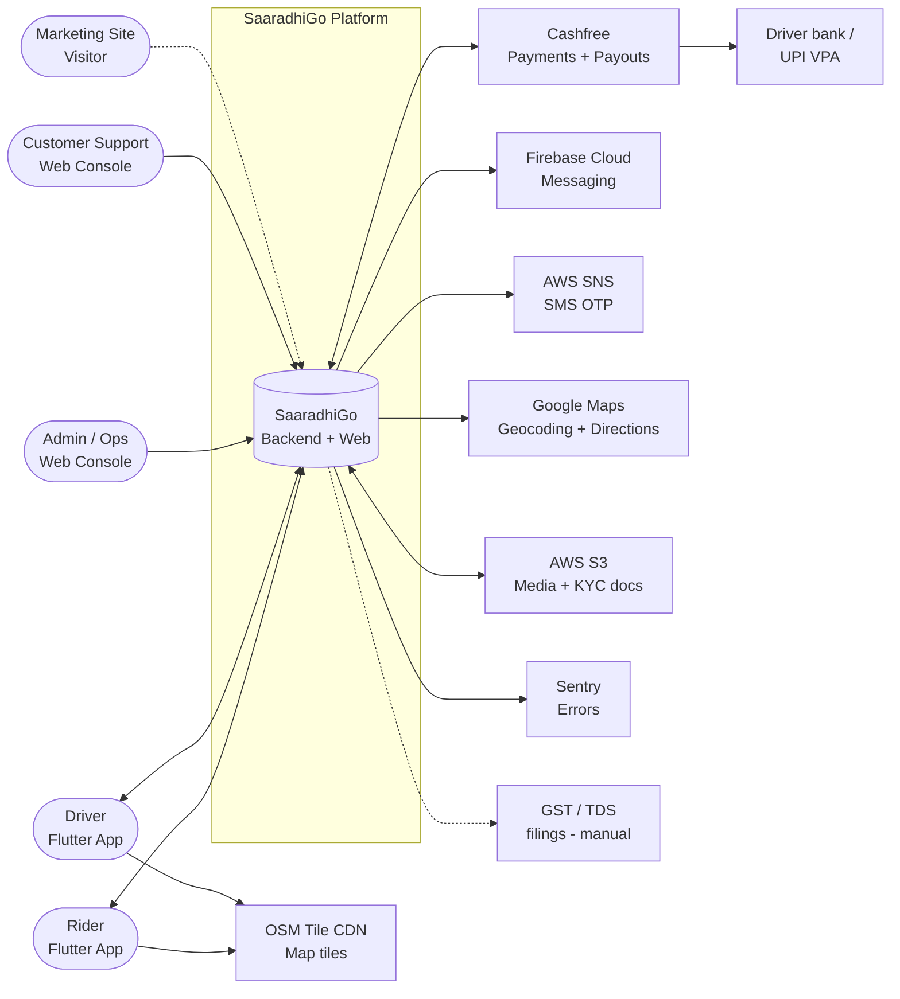

**Notes**

- **Cashfree** is the *only* gateway for both payment-in (rider → platform) and payout-out (platform → driver). We deliberately keep a clean `PaymentGateway` interface (see [`servers/payments/payment_gateways/base_gateway.py`](https://github.com/SaaradhiGo/SaaradhiGo-backend/blob/dev/servers/payments/payment_gateways/base_gateway.py)) so a second gateway (Razorpay, PhonePe PG) can be added without changes outside the `payments` app.
- **Google Maps Directions** is used server-side for distance/duration computation that drives fare. Client-side distance is never trusted.
- **OSM tiles** are consumed directly by the mobile apps via `flutter_map` for display. Routing polylines come from our backend (which proxies Google Directions), not from a public OSRM instance.
- **AWS SNS** delivers OTP SMS in Phase-0. Switching to MSG91 / Twilio India is one config flip.
- **GST / TDS** are out-of-system in Phase-0 (handled by finance via exported reports). In Phase-1 we add a ledger export pipeline.

---

## 3. High-level architecture (container view)

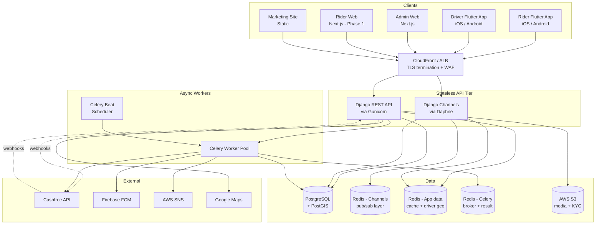

**Key design properties**

- **Strict separation of stateless API tier from stateful Redis/Postgres**. API tier auto-scales horizontally; data tier scales vertically + read replicas.
- **WS and REST share the same Django codebase** but run as separate processes (Daphne for ASGI/WS, Gunicorn for WSGI/REST) so we can scale them independently — WS connection count grows ~linearly with online drivers; REST RPS grows with trip-create.
- **Redis is split into three logical instances** (Phase-1 onwards): Channels (pub/sub), App-data (cache + driver geo index), and Broker (Celery). In Phase-0 these live on a single Redis instance with different DB indices, as today. The split is a config change, not a code change.
- **All long-running work (FCM push, SNS SMS, Cashfree payout, reconciliation) runs in Celery**, never inline in request/WS handlers. Today some FCM calls are inline in WebSocket consumers — that's a known correctness/perf bug to fix.
- **Postgres is the only durable source of truth.** Redis state is always reconstructable.
- **Trip-flow side-effects** (notifications, payment captures, settlement) run via `transaction.on_commit(lambda: task.delay(...))` so a rolled-back transaction never fires a notification or payout.

---

## 4. Bounded contexts

```mermaid
flowchart LR
    subgraph identity[Identity context]
        Auth[Authentication<br/>OTP, JWT, sessions]
        Users[Users + Profiles<br/>rider/driver/admin]
        KYC[KYC Documents<br/>license, RC, insurance]
    end

    subgraph supply[Supply context]
        Driver[Driver Lifecycle<br/>onboarding, status, online/offline]
        Vehicle[Vehicles<br/>RC, insurance, fitness, permit]
        Earnings[Earnings + Settlement]
        Payouts[Withdrawals + Payouts]
    end

    subgraph demand[Demand context]
        Favorites[Saved Locations]
        Wallet[Rider Wallet<br/>closed-loop]
        History[Ride History]
    end

    subgraph trip[Trip context]
        Pricing[Fare + Surge Pricing]
        Matching[Driver Matching]
        TripState[Trip State Machine]
        Live[Live Tracking]
        Rating[Ratings + Reviews]
    end

    subgraph payments[Payments context]
        Orders[Payment Orders]
        Verify[Verification + Webhooks]
        Refunds[Refunds]
        Recon[Reconciliation]
    end

    subgraph ops[Operations context]
        Notifications[Push + In-app<br/>Notifications]
        Support[Support Tickets<br/>+ Disputes]
        SOS[SOS / Emergency]
        Audit[Admin Audit Log]
        Reports[Reports + Exports]
    end

    identity --> supply
    identity --> demand
    supply --> trip
    demand --> trip
    trip --> payments
    payments --> supply
    trip --> ops
    payments --> ops
```

Each context maps to a Django app under `servers/`. A context owns its database tables; cross-context reads happen via the owning app's services, never via direct ORM queries.

### Phase-0 → 12-month mapping

| Context       | Phase-0 home                 | 12-month target                        |
| ------------- | ---------------------------- | -------------------------------------- |
| Identity      | `auth_user` Django app       | Same app + an external IdP option      |
| Supply        | `driver` Django app          | Same; settlement may split into ledger service |
| Demand        | `rider` Django app           | Same                                   |
| Trip          | `ride` + `consumers.py`      | Same; matching extracted as a service for multi-city |
| Pricing       | `pricing` Django app (ServiceZone + RateCard; see [ADR-0002](adr/0002-multi-city-pricing.md)) | Same + a SurgeRule table for per-zone editable rule sets |
| Payments      | `payments` Django app        | Same + a dedicated reconciliation worker |
| Operations    | `support` + ad-hoc           | Dedicated ops/SOS app + audit service  |

We deliberately do **not** plan a microservices split for Phase-0 or Phase-1. The bounded contexts are *modular monolith* boundaries inside one deployable. The cost of microservices (cross-service auth, distributed tracing, eventual consistency around money) is not justified at the target scale.

---

## 5. Core flows (sequence diagrams)

### 5.1 Rider OTP login

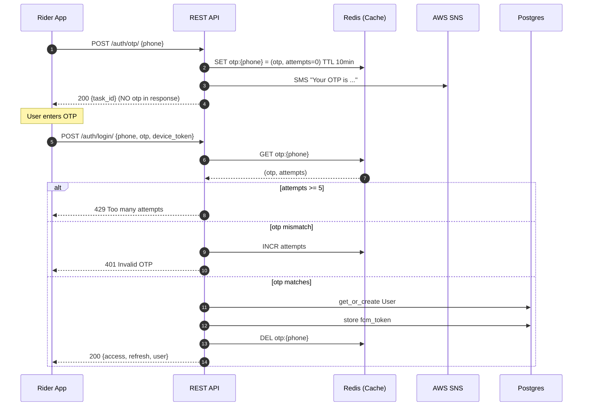

Notes: OTP must never be returned in the API response body and must never be written to a logger. Throttle on both `/auth/otp/` and `/auth/login/` (per phone + per IP) using DRF `ScopedRateThrottle`.

### 5.2 Ride booking (matching)

```mermaid
sequenceDiagram
    autonumber
    participant R as Rider App
    participant WS as Channels (RideRequestConsumer)
    participant Geo as Redis (Driver Geo)
    participant DB as Postgres
    participant Pub as Channels Layer
    participant D as Driver App(s)
    participant FCM as FCM

    R->>WS: connect /ws/ride/request/ + JWT
    R->>WS: {action:"request", pickup, drop, vehicle_type}
    WS->>DB: server-recompute distance via Google Directions
    WS->>DB: BEGIN tx; INSERT Trip(status=requested); commit
    WS->>WS: schedule auto_cancel via transaction.on_commit
    WS-->>R: {trip_created, trip_id, estimated_fare}

    loop Rolling fanout (20s waves, expanding radius)
        WS->>Geo: GEOSEARCH near pickup, vehicle_type
        Geo-->>WS: nearest N drivers
        WS->>Pub: group_send to per-driver groups
        Pub-->>D: {ride_request, trip_id, fare, pickup}
        WS->>FCM: data-only high-priority push (Celery, async)
    end

    D->>WS: {action:"accept"}  (via TripStatusConsumer)
    WS->>DB: SELECT FOR UPDATE Trip WHERE status=requested
    alt already accepted
        WS-->>D: error "taken"
    else success
        WS->>DB: UPDATE Trip status=accepted, driver_id, accepted_at
        WS->>Pub: group_send "trip_taken" to other notified drivers
        WS->>Pub: group_send "trip_update" to rider group only (with OTP)
        WS-->>D: ack (no OTP to driver)
    end
```

Key invariants enforced here that the current code does *not* yet enforce:

- Distance/duration are always server-computed; the client-supplied numbers in the WS payload are ignored.
- Rolling fanout uses short timeouts per wave (e.g. 20s) and expands radius on each wave, instead of a single 600s bucket.
- Losing drivers receive an explicit `trip_taken` event so their UI dismisses the request popup.
- The trip start OTP is sent only to the rider's personal channel group, never to the shared `trip_<id>` group.
- A driver is checked for `approved AND status != 'blocked'` at accept-time, not only at WS-connect-time.

### 5.3 Trip state machine

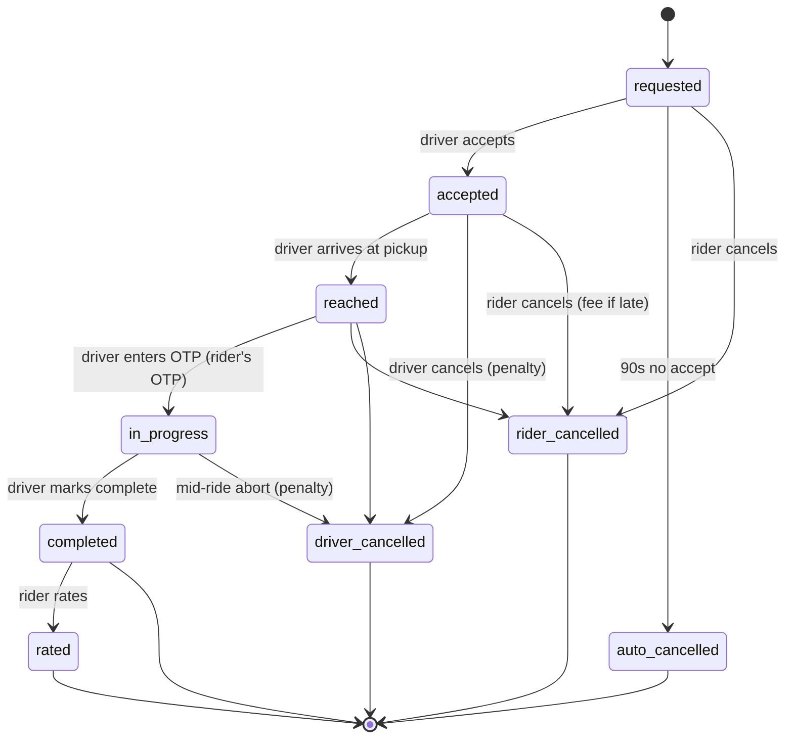

**Distinct cancellation states.** Today the code collapses every cancel into `cancelled`. For ops, dispute, and policy enforcement, we differentiate rider-cancel, driver-cancel, and auto-cancel — different penalty/refund rules apply.

Every transition is implemented as a single DB transaction with `SELECT FOR UPDATE` on the `Trip` row. Side-effects (notification push, payment capture, settlement credit) run via `transaction.on_commit`.

### 5.4 Online payment with webhook

```mermaid
sequenceDiagram
    autonumber
    participant R as Rider App
    participant API as REST API
    participant DB as Postgres
    participant CF as Cashfree
    participant CFW as Cashfree Webhook
    participant Q as Celery (Recon)

    Note over R,API: Trip completed, payment_method=online
    R->>API: POST /payments/create-order/ {trip_id}
    API->>DB: SELECT FOR UPDATE Trip; SELECT FOR UPDATE Payment row<br/>(create if not exists, ensure not already paid)
    API->>CF: Create Order (amount, customer phone+email of THIS rider)
    CF-->>API: cashfree_order_id, payment_session_id
    API->>DB: Payment(status=processing, cashfree_order_id)
    API-->>R: {payment_session_id}

    R->>CF: Cashfree SDK collects payment
    CF-->>R: SDK returns success (UI cue only)
    R->>API: POST /payments/verify/ {order_id}
    API->>CF: GetOrderStatus(order_id)
    CF-->>API: order_status=PAID, order_amount

    par
        API->>DB: BEGIN; SELECT FOR UPDATE Payment<br/>if status != completed: mark completed, credit driver via on_commit; commit
        API-->>R: {success, balance}
    and
        CFW->>API: POST /payments/webhook/ (signed)
        API->>API: verify HMAC + timestamp window<br/>(reject if secret missing)
        API->>DB: idempotent upsert (event_id unique)<br/>if Payment not completed: mark completed, credit driver
    end

    Q->>DB: every 5min: find Payments stuck in processing > 15min
    Q->>CF: GetOrderStatus
    Q->>DB: converge state
```

Critical guarantees:

- **Server is the only authority on `order_amount`.** The amount stored in `Payment` is read from Cashfree, not from the rider's request body.
- **Idempotent settlement.** Both the rider verify path and the webhook path go through a single `SELECT FOR UPDATE` + status-gate. Whoever lands first marks the payment complete; the second is a no-op.
- **Webhook signature is mandatory.** Missing secret fails closed at app boot, not silently in the handler.
- **Webhook replays are rejected.** Events outside a 5-minute timestamp window or with a known `event_id` are dropped.
- **A reconciliation worker** sweeps stuck-in-processing payments every 5 minutes — at-least-once webhook delivery is no longer load-bearing.

### 5.5 Driver withdrawal / payout

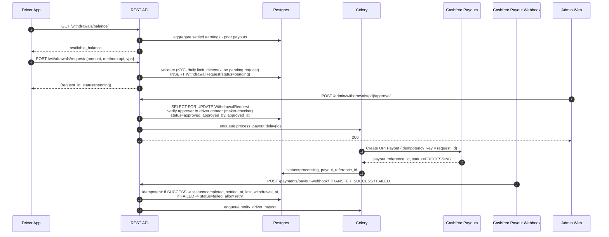

Key properties:

- **Maker-checker:** the admin who approves a withdrawal cannot be the same admin who last modified the driver's bank/UPI details within the prior 7 days. Above an INR threshold (say ₹25,000), two admin approvals are required.
- **All payout state changes go through the webhook.** The synchronous Cashfree response only flips us to `processing`. `completed` and `failed` come from signed webhook events.
- **`last_withdrawal_at` updates on success only**, not at request time. (Current code updates pre-payout — fixed in design.)
- **An immutable `WithdrawalAuditLog` row** is written inside every state-change transaction.

### 5.6 SOS / Emergency (MVA 2020 mandatory)

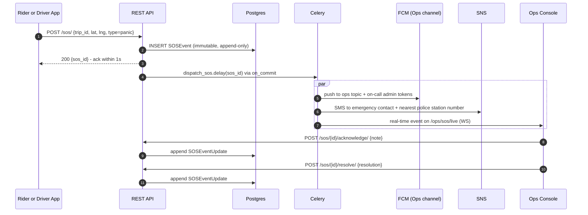

SOS events are append-only. Acknowledge and resolve are recorded as updates, not in-place edits. A 24/7 ops on-call rotation receives both push and SMS.

---

## 6. Real-time / WebSocket architecture

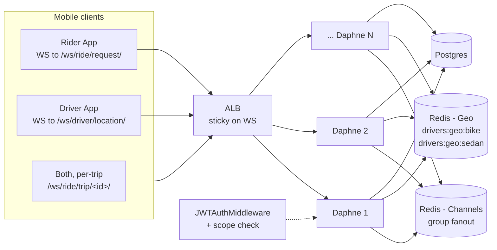

### Channel groups

| Group                    | Members                                                                                     | Purpose                                  |
| ------------------------ | ------------------------------------------------------------------------------------------- | ---------------------------------------- |
| `rider_<user_id>`        | Rider's WS                                                                                  | Rider-only events (trip OTP, status)     |
| `driver_<user_id>`       | Driver's WS                                                                                 | Driver-only events (ride request)        |
| `trip_<trip_id>`         | Rider + ONLY the assigned driver                                                            | Bidirectional trip-state events          |
| `ops_sos`                | On-call admin WS connections                                                                | SOS / panic broadcasts                   |
| `ops_live_map`           | Ops dashboard WS connections                                                                | Aggregate driver location stream         |

**Hard rule:** a driver does not join `trip_<id>` until *after* their accept transaction commits and `Trip.driver_id` is set to them. No early subscription. This is the fix for the current group-IDOR bug where any driver can read another trip's OTP.

### Driver presence and geo index

- Online drivers are tracked in a Redis sorted-set per vehicle type: `drivers:geo:sedan`, `drivers:geo:bike`, etc.
- Each driver has a `driver:heartbeat:<id>` key with TTL 30s. The location update path refreshes both the geo entry and the heartbeat.
- A Celery beat sweeper runs every 60s and removes geo entries whose heartbeat has expired — fixes "ghost driver" stickiness on crash.
- Vehicle-type filtering happens at the Redis query layer (per-vehicle keys), not in Python after a large fetch.

### Reconnect & state recovery

- On WS reconnect the server immediately pushes a `trip_snapshot` (current status, driver info, last known location, payment status, OTP if rider) so the client doesn't depend on REST polling.
- Access tokens have a 15-minute TTL. The client re-mints a token via the refresh endpoint and reconnects without user action.
- All mutating actions over WS carry a client-generated `action_id` so the server can dedupe at-least-once retries.

---

## 7. Data architecture

### 7.1 Postgres — primary store

Single logical database, multiple schemas mapped to Django app namespaces. Service-area polygons are stored as GeoJSON in `JSONField` columns with point-in-polygon evaluated in-process via Shapely — PostGIS is **not** a Phase-1 dependency (see [ADR-0002](adr/0002-multi-city-pricing.md)). The model is forward-compatible: when the active-zone count crosses ~100, a future migration converts the column to PostGIS `PolygonField` with a spatial index. Trip pickup geometry stays in Postgres as decimal lat/long today; geo-indexing for matching lives in Redis (`drivers:geo`, `riders:geo`).

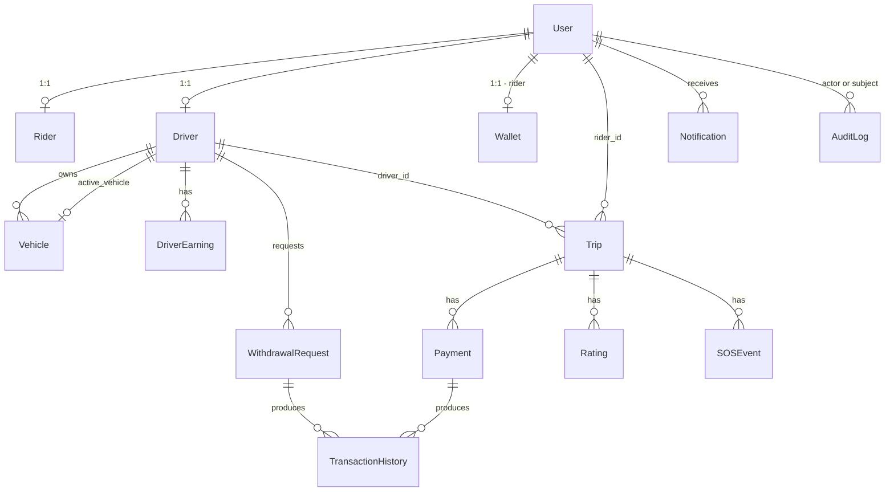

**Phase-0:** single Postgres (RDS db.t3.medium or db.m5.large), daily snapshot + 7-day PITR.

**12-month target:**
- Primary + one read replica for admin dashboards and ad-hoc reports.
- Logical replication slot feeding a downstream warehouse (Phase-1).
- Partition `Trip`, `Payment`, `TransactionHistory`, `Notification` by `created_at` monthly once table size > 10M rows.

### 7.2 Redis — split by role

| Role           | Phase-0                  | Phase-1 target                    | Used by                                  |
| -------------- | ------------------------ | --------------------------------- | ---------------------------------------- |
| Channels layer | Shared Redis, DB index 4 | Dedicated Redis cluster           | Channels group fanout                    |
| App cache      | Shared Redis, DB index 1 | Dedicated Redis (`cache.*`)       | OTP cache, profile cache, idempotency    |
| Driver geo     | Shared Redis, DB index 2 | Same dedicated Redis as app cache | `drivers:geo:*` sorted sets, heartbeats  |
| Celery broker  | Shared Redis, DB index 0 | Dedicated Redis cluster           | Celery queues + result backend           |

Splitting only requires changes to `settings.py` URLs.

### 7.3 S3 — object storage

Two buckets:

| Bucket                       | Contents                                  | Access                                       |
| ---------------------------- | ----------------------------------------- | -------------------------------------------- |
| `saaradhigo-public-media`    | Avatars, vehicle photos for display       | Signed URLs, 15-min expiry                   |
| `saaradhigo-kyc-private`     | License, RC, Aadhaar (masked), insurance  | Signed URLs, 60-sec expiry, access audit-logged |

KYC bucket has server-side encryption (KMS), versioning, MFA-delete on the production account.

### 7.4 Analytics / warehouse (Phase-1)

- Daily logical-replication snapshot from Postgres → S3 → loaded into a BigQuery / Snowflake instance.
- Application emits a stream of business events (`trip.requested`, `trip.completed`, `payment.captured`, `withdrawal.completed`) to a Kafka topic in Phase-2. For Phase-0/1 we ship event records to a dedicated `events` Postgres table and ETL nightly.
- BI tooling (Metabase) reads the warehouse, never the production DB.

---

## 8. Mobile architecture

### 8.1 Two apps + one shared package

```
SaaradhiGo-mobile/        Rider app (VahanGo)
SaaradhiGo-driver/        Driver app (SaaradhiGo Drive)  -- to be created
SaaradhiGo-mobile-shared/ Shared Dart package            -- to be created
  - api/                  HTTP client, request/response models
  - ws/                   WebSocket client, event models
  - models/               Trip, User, Vehicle, Payment, etc.
  - design_system/        Buttons, theme, typography, brand colors
  - location/             Permissions, location service abstraction
  - auth/                 Token store (secure storage), refresh interceptor
```

- The shared package is versioned semver and consumed via `path:` reference in monorepo, or git tag once stabilised.
- Rider and driver apps share state-recovery primitives, API/WS clients, theme, and crash-reporting. Each owns its own screens, navigation, and product-specific providers.
- Each app has its own Play Store / App Store listing, its own bundle ID (`com.saaradhigo.rider`, `com.saaradhigo.driver`), its own Firebase project (so a driver's FCM token can never deliver to the rider app or vice-versa).

### 8.2 State management

We standardise on **Riverpod 3** across both apps. The current hybrid Provider + Riverpod setup in the rider app is paid down in Phase-0.5.

- Server-state and ride lifecycle: Riverpod (with `riverpod_annotation` code-gen).
- Local UI state: `setState` / `StatefulWidget`.
- Persistence: `Hive` (with encryption) for ride state cache + offline queue; `flutter_secure_storage` for auth tokens and KYC artefacts.

### 8.3 Offline & resilience

- The rider app keeps a "last known trip snapshot" in Hive, refreshed on every WS event.
- On cold-start the app:
  1. Reads the snapshot from Hive (instant UI).
  2. Calls `/ride/active/` (authoritative).
  3. Reconciles — server wins on conflict.
  4. Opens WS and applies any deltas.
- All mutating REST calls and WS actions carry a client-generated `action_id`. The server dedupes via Redis. The client retries on transient failures without fear of double-effect.
- On India OEMs (Xiaomi, Vivo, Oppo, Realme) we run a foreground notification service for the duration of a live trip — both apps. The notification is updated by Riverpod state changes; lacking the service is the #1 reason rides "disappear" in this market.

### 8.4 Maps & routing

- **Display:** `flutter_map` with OSM tiles (with mandatory attribution). For Phase-1 we evaluate Mapbox SDK for nicer styling.
- **Routing / polylines:** server-side — the mobile app calls our `/ride/route/` endpoint, which calls Google Directions and caches results. No public OSRM endpoint is ever called from the client.
- **Geocoding / place search:** same — proxy through backend. Keeps the Google API key off the device.

### 8.5 Permissions

- iOS: `NSLocationWhenInUseUsageDescription` for both apps; `NSLocationAlwaysAndWhenInUseUsageDescription` for the driver app only (it tracks location while online). `NSCameraUsageDescription` + `NSPhotoLibraryUsageDescription` where image pickers are used.
- Android: `ACCESS_FINE_LOCATION` + `ACCESS_COARSE_LOCATION`; driver app additionally requests `ACCESS_BACKGROUND_LOCATION` with explicit rationale screen. `POST_NOTIFICATIONS` on Android 13+. `FOREGROUND_SERVICE_LOCATION` for the driver app's online state.
- Both apps explicitly handle each denied permission with a graceful fallback.

---

## 9. Web architecture

### 9.1 Apps and their owners

| App           | Purpose                                                   | Phase-0 status | 12-month target          |
| ------------- | --------------------------------------------------------- | -------------- | ------------------------ |
| Marketing     | Public site, app store links, support, legal              | Static / Next.js | Headless CMS-backed     |
| Admin Console | KYC approvals, withdrawals, trips, disputes, SOS triage, reports | **Must ship**  | Role-based; ops + finance + support roles |
| Rider Web     | Book rides from a browser                                 | Out of scope   | Phase-1                  |
| Driver Web    | (not built)                                               | Out of scope   | Likely never; drivers are mobile-first |
| Status Page   | Public uptime status                                      | Phase-0.5      | Phase-0.5                |

### 9.2 Admin Console (Phase-0 critical)

- Stack: **Next.js + TypeScript + react-query + Tailwind + shadcn/ui** (or Refine if we prefer batteries-included).
- Talks to existing `/api/v1/admin/*` REST endpoints (no separate admin API).
- Auth: same JWT, but admin tokens carry an `admin` scope that we enforce server-side in a single `IsAdmin` permission class (today there are two divergent ones).
- Audit log visible to all admins; every state-change action shows actor + reason.
- Role split: Operations admin (KYC, dispatch, SOS), Finance admin (withdrawals, reports, refunds), Support admin (tickets, ride disputes). Phase-0 can ship with a single role and split later.

---

## 10. Security architecture

### 10.1 Authentication

- Phone-number + SMS OTP for rider & driver. OTPs are **never** returned in API responses or logs.
- Admin / Support: phone-number + OTP + an additional TOTP step (Google Authenticator) before any write operation. Phase-0.5 adds SSO via Google Workspace.
- OTP generation uses `secrets.choice` (CSPRNG), TTL 10 min, max 5 wrong attempts then 15-min lockout, max 3 OTP requests per 30 min per phone+IP.
- JWT (HS256, dedicated `SIGNING_KEY` distinct from `SECRET_KEY`):
  - Access token: 15 min, includes `role`, `user_id`, `iss`, `aud`.
  - Refresh token: 14 days, rotating, single-use; the `token_blacklist` app revokes used tokens.
  - Logout endpoint blacklists the refresh token.
- WebSocket auth: token is passed in the first message after `accept()`, not in the query string. Token is re-checked every 5 minutes; expired tokens cause a clean close so the client refreshes and reconnects.

### 10.2 Authorization

- A single `IsAdmin` permission class that requires `is_staff = True` + `role = 'admin'`. Imported everywhere admin endpoints exist.
- Object-level permissions for trip endpoints (can the requesting user see this trip?) are centralised in `ride/permissions.py`.
- Every admin write enforces maker-checker for high-impact ops (KYC approval, withdrawal approval > threshold, driver delete).

### 10.3 Secrets

- Phase-0: AWS SSM Parameter Store. No secret is committed to git. The `.env.local` / `.env.prod` files are *templates only*; real values are injected at container start from SSM via an entrypoint script.
- Rotation: payment and FCM secrets rotated quarterly; database credentials rotated semi-annually via RDS.
- The leaked Postgres password (`PossibleMe2025`) must be rotated and the git history scrubbed before launch.

### 10.4 Transport & headers

- TLS 1.2+ everywhere. HTTP→HTTPS redirect at the ALB.
- HSTS (1 year, includeSubDomains), `X-Content-Type-Options: nosniff`, `X-Frame-Options: DENY`, `Referrer-Policy: strict-origin-when-cross-origin`, locked-down `Content-Security-Policy` for the admin web.
- `CORS_ALLOWED_ORIGINS` is an env-driven allowlist. `SessionAuthentication` is removed from DRF defaults.

### 10.5 Application-layer

- All write endpoints accept an idempotency key.
- All money flows go through `select_for_update` + Decimal arithmetic.
- Webhooks: HMAC signature mandatory (fail closed if secret missing), timestamp window 5 min, event-id dedupe.
- File uploads sniff content via `python-magic`, not the client `Content-Type` header.
- `DEBUG = False` in prod; root logger at `WARNING`; PII/OTP/token redaction filter applied at every handler.
- Rate limits: per-IP global, per-user authenticated, per-endpoint scoped (auth endpoints get the tightest).

### 10.6 Pen test & vuln management

- Static analysis (Bandit, Semgrep) in CI.
- Dependency scanning (Dependabot + `pip-audit` on the backend, `dart pub outdated --mode=security` on mobile).
- Annual external pen test starting Phase-1.

---

## 11. Compliance architecture

### 11.1 MV Aggregator Rules 2020 (MoRTH)

| Requirement                                        | Implementation                                                      |
| -------------------------------------------------- | ------------------------------------------------------------------- |
| In-trip SOS / panic button                         | `/sos/` endpoint + SOS context + ops on-call                        |
| Driver background verification + police verification | `Driver.police_verification_status` + KYC approval gate           |
| Vehicle insurance / permit / fitness / PUC validity| Per-vehicle expiry fields + daily Celery job + auto-block on expiry |
| Driver fatigue cap (12 hours active in 24h)        | `DriverSession` ledger + `servers.driver.fatigue.get_fatigue_status` + accept-time gate in `consumers._accept_trip`. Lockout stored on `Driver.fatigue_lockout_until` for O(1) checks. |
| Surge cap (max 1.5× base)                          | Per-zone `RateCard.surge_cap_multiplier`, enforced centrally in `pricing.services.quote_fare` (see [ADR-0002](adr/0002-multi-city-pricing.md)) |
| Fare receipts (CGST §31)                           | `Receipt` model + `servers.ride.receipts.issue_receipt` (HTML email via SES on trip-complete; resend endpoint at `/api/v1/ride/trip/<id>/receipt/resend/`). PDF generation deferred to Phase-1. |
| Notification opt-in / opt-out (DPDP)               | `NotificationPreference` model with marketing/promo default OFF; safety + transactional + payout categories cannot be turned off; dispatch via `servers.rider.notifications.create_notification`. |
| Driver-side cancellation policy                    | `DriverCancellation` ledger + rolling 24h counter; 3 cancels → 1h online lockout (shares `Driver.fatigue_lockout_until`) + 0.1 rating decrement. Endpoint: `/api/v1/ride/trip/<id>/driver-cancel/`. |
| Customer support                                   | `SupportTicket` + `SupportMessage` thread model; rider + admin endpoints under `/api/v1/support/`. |
| Phone-call privacy                                 | Mobile uses OS dialer (`tel:` deep-link) — raw driver phone is never displayed in the rider UI. Phase-1 swaps in a masking proxy (Exotel / Knowlarity) with no UX change. |
| Data localisation                                  | Primary DB and S3 in `ap-south-1` (Mumbai); KYC never leaves region |

### 11.2 DPDP Act 2023

- Consent recorded at signup (`User.consents` JSON: terms, location, marketing, KYC) with version + timestamp.
- `/me/export/` — produces a JSON export of all user data within 24h, delivered via signed S3 URL.
- `/me/delete/` — soft-deletes immediately, scheduled hard-delete after the legally-required retention window (7 years for financial records).
- Breach notification SOP: documented in `runbooks/breach-response.md` once written; DPO contact in CISO escalation list.

### 11.3 RBI / Wallet posture

- The rider wallet in Phase-0 is treated as a **closed-loop platform wallet** (PPI exemption): balance can only be used to pay for rides on SaaradhiGo, cannot be transferred to other users, cannot be cashed out.
- Hard ceiling of ₹10,000 balance, ₹2,000 single top-up, no interest, no merchant pay-through.
- A rider's wallet and a driver's settlement account are **separate Postgres rows** — a driver who is also a rider cannot drain settlement money via the rider wallet endpoint. (Today they're the same `Wallet` row — fix on Phase-0 path.)
- If/when we want open-loop semantics, we partner with a PPI-licensed bank rather than self-license.

### 11.4 Tax (GST + TDS)

- GST: 18% on the platform commission. Stored on every `TransactionHistory` row; aggregated for monthly GSTR-1 / GSTR-3B filing.
- TDS u/s 194O: 1% on gross driver payouts above ₹5L/year per driver. Tracked per-PAN, deducted at payout time, remitted monthly.
- Phase-0: implemented in code, manually filed by finance. Phase-1: automated reports.

---

## 12. Deployment topology

### 12.1 Phase-0

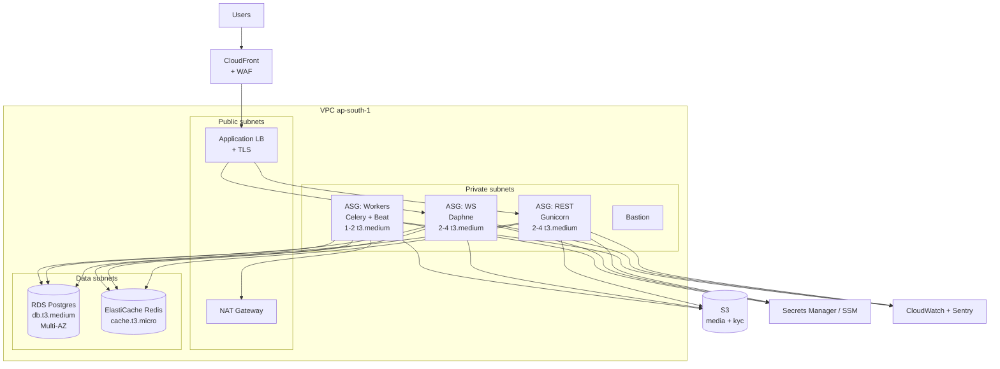

- Single AWS region: `ap-south-1` (Mumbai).
- Multi-AZ on RDS (synchronous standby).
- Single-AZ ElastiCache in Phase-0 (acceptable risk; cluster mode in Phase-1).
- Bastion for emergency DB access only; routine DB access via session manager + role-assumption.
- Auto-scaling groups behind ALB for REST and WS, separate target groups. WS target group has sticky cookies (`source IP` + Channels affinity).
- Celery workers in their own ASG; min 1, max 4. Beat singleton via a fixed-instance ASG.

### 12.2 Phase-1 / 12-month

- ElastiCache cluster-mode (sharded), 3 logical instances (channels, app, broker).
- RDS read replica for admin/reports.
- Move REST/WS/Workers to ECS Fargate or EKS — we expect this to be a 1-sprint migration when CPU/mem on EC2 gets uncomfortable. The Docker images already work; the AMI is the only EC2-specific bit.
- Adopt CloudFront origin shield, AWS Shield Standard, optionally Shield Advanced.
- Add a warm-standby region (`ap-southeast-1` or `us-east-1`) for DR.

---

## 13. Observability & SRE

| Pillar      | Phase-0                                                  | 12-month target                              |
| ----------- | -------------------------------------------------------- | -------------------------------------------- |
| Errors      | Sentry (backend + both mobile apps + admin web)          | Same + Sentry release tracking + perf        |
| Logs        | CloudWatch Logs (structured JSON), 30-day retention      | + Loki/Datadog, PII scrubbing at source      |
| Metrics     | CloudWatch + a `prom_client` `/metrics` endpoint scraped by a single Prometheus | Managed Prometheus + Grafana   |
| Traces      | None                                                     | OpenTelemetry → Tempo / Honeycomb            |
| Uptime      | BetterStack pings every 30s on `/healthz` and a synthetic trip-create | Same + per-region                |
| Alerts      | PagerDuty: REST error rate > 2%, WS reconnect > 5%/min, payment success < 90% (rolling 10min), DB CPU > 80%, Redis memory > 80%, queue depth > 1000 | Same + business KPIs                    |
| On-call     | Founding eng rotation (1 week shifts)                    | Tiered: app on-call + infra on-call          |

### Service Level Objectives (Phase-0)

| SLI                              | Objective       | Error budget (28d) |
| -------------------------------- | --------------- | ------------------ |
| Trip-create REST success         | 99.5%           | 3.6h               |
| Trip-create p95 latency          | < 1.5s          | n/a                |
| WS connection acceptance         | 99.5%           | 3.6h               |
| Payment webhook processing       | 99.9%           | 43min              |
| SOS dispatch end-to-end          | 100% within 5s  | 0                  |

SOS is the only SLO with zero error budget; any breach is a P0 incident.

### Key dashboards (Phase-0 deliverables)

- **Ride funnel** — request → match → accept → start → complete by 5-min bucket.
- **Money** — payments succeeded/failed/refunded/reconciled, wallet balance delta, settlement payouts.
- **Supply** — online drivers by zone & vehicle type, accept rate, cancel rate.
- **Health** — REST latency/error, WS connections, Redis & RDS load, Celery queue depth.

---

## 14. CI/CD & environments

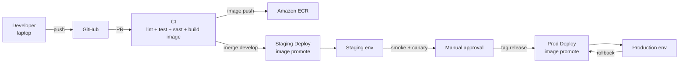

### Environments

| Env       | Purpose                          | Data                              | Deploy trigger        |
| --------- | -------------------------------- | --------------------------------- | --------------------- |
| `local`   | Dev laptops                      | Docker compose, seeded fixtures   | `docker compose up`   |
| `staging` | Pre-prod soak, QA, demos         | Daily reset from anonymised prod  | Merge to `develop`    |
| `prod`    | Customers                        | Real                              | Tag on `main`         |

### Branching (replaces the current 5-level guide)

Two long-lived branches: `develop` (auto-deploys to staging) and `main` (deploys to prod on tagged release). Feature branches → PR → `develop`. We retire the 5-level model — it's overkill at this team size and isn't fully implemented anyway.

### Pipeline checks (all PRs)

- Backend: `ruff` lint, `pytest` (unit + integration), `bandit` SAST, `pip-audit`, `docker build`.
- Mobile: `dart format --set-exit-if-changed`, `flutter analyze`, `flutter test`, build APK + IPA artifacts.
- Web: `eslint`, `tsc --noEmit`, `vitest`, `pnpm audit`, `next build`.
- Required status checks for `develop` and `main` (branch protection).

### Rollback

- Prod deploys are image-tag promotions. Rollback = re-tag the previous image and re-run the deploy workflow.
- Database migrations are forward-only and backwards-compatible by convention (expand-then-contract). A bad migration is not rolled back; a new migration corrects it.
- Documented in `runbooks/rollback.md` once written.

---

## 15. Capacity planning

Sizing assumptions for Phase-1 (the design target):

| Metric                                    | Phase-1 target | Implication                                            |
| ----------------------------------------- | -------------- | ------------------------------------------------------ |
| Online drivers, peak                      | 5,000          | 5k concurrent WS, 1k loc updates/sec (5-sec ping)      |
| Active riders during ride, peak           | 4,000          | 4k concurrent WS                                       |
| Trip creates, peak                        | 5 RPS          | ~200 ms work each; trivial for REST tier               |
| Payment webhooks, peak                    | 3 RPS          | All async; well within Celery throughput               |
| Driver location update RPS                | 1,000          | Redis GEOADD; ElastiCache `cache.r6g.large` headroom  |
| Daphne worker concurrency target          | 250 conn/worker | 5k + 4k WS = ~36 workers needed; ASG 4× t3.large does it |
| Postgres TPS, peak                        | ~300           | Comfortable on `db.m5.large`                          |
| Hot tables (Trip, Payment, Notification)  | 50-100M rows / yr | Monthly partitioning by `created_at` from Phase-1     |

These numbers say: **the system is small.** We don't need exotic scaling. Get the correctness fixes done and the rest is operational discipline.

---

## 16. Reliability, backups, DR

- **Backups:** RDS automated daily snapshots + 7-day PITR. KYC bucket versioning with 90-day non-current retention. Snapshots replicated cross-region monthly in Phase-1.
- **Failure modes considered:**
  - Single AZ outage → RDS multi-AZ + ASGs span 2 AZs.
  - Redis outage → REST and WS degrade gracefully (cache miss = slow but functional; WS connect denied with a clear error code so the client retries with backoff).
  - Cashfree outage → trips continue (cash payments work); online payments queue with retry; alerts fire after 5 min.
  - FCM outage → fall back to SMS for ride-state notifications; alert.
  - Region outage → Phase-0 accepts 4h RTO with cross-region snapshot recovery. Phase-1 stands up warm standby.
- **Game days:** quarterly, starting Phase-0.5. Take down one component in staging, validate observability and runbook coverage.

---

## 17. Roadmap (current → Phase-0 → 12-month)

| Track                  | Today                          | Phase-0 (launch)                            | Phase-0.5 (+3mo)                  | 12-month                            |
| ---------------------- | ------------------------------ | ------------------------------------------- | --------------------------------- | ----------------------------------- |
| Backend correctness    | ~25 audit-identified P0/P1 bugs | All P0 closed, regression tests             | All P1 closed                     | Pen-test clean                      |
| Identity & auth        | OTP returned in API, no logout | Hardened, refresh rotation, throttle, MFA admin | SSO admin                       | Identity service factored out       |
| Ride engine            | Trip group IDOR, no service area | Server-side service area + state machine fixes + rolling fanout | Surge pricing v2 | Multi-zone matching                  |
| Payments               | Webhook bypass, double-credit  | Idempotent + signed + reconciliation worker | TDS automated, partial refunds   | Multi-gateway                       |
| Driver onboarding      | KYC approve with empty docs    | Document gate + audit log + maker-checker   | Background verification API integ | KYC as a service                    |
| Driver app             | Doesn't exist                  | Built, in store                             | Feature parity with Ola Driver MVP | Earnings predictions, navigation    |
| Rider app              | Hybrid state, tokens in plaintext | Riverpod migration, secure storage, refresh interceptor | Hindi + Telugu localisation | Rider web                       |
| Admin console          | Doesn't exist                  | KYC, withdrawals, trips, SOS, audit         | Roles, reports, refunds UI       | Full ops platform                   |
| Observability          | None                           | Sentry + structured logs + healthchecks + alerts | Prometheus, BI dashboards   | Tracing + SLO-driven                |
| Compliance             | None                           | MVA 2020 minimums, DPDP endpoints, wallet posture | GST/TDS automation, ISO 27001 in flight | ISO 27001 certified         |
| Infra                  | Single EC2, git-pull deploy    | ASGs + image deploys + staging env          | ECS Fargate, multi-AZ Redis      | Warm-standby DR region              |
| Repo strategy          | 3 repos, drift                 | 4 repos (+ driver app + shared package) + this docs repo | OpenAPI codegen for clients   | Same                                |

---

## 18. Open questions / ADR backlog

These need decisions before or during Phase-0; each becomes an ADR when decided.

1. **Surge model.** Today: demand/supply ratio + ping-count. Proposed: time-of-day base × demand-supply factor, capped at 1.5×. ADR pending.
2. **Driver settlement frequency.** Daily T+1, weekly, or on-demand? Affects working-capital and Cashfree payout fee model. ADR pending.
3. **Rider wallet retention.** Keep, or drop wallet in Phase-0 and route everything through Cashfree directly? Simpler and avoids PPI ambiguity. ADR pending.
4. **Identity provider.** Stay on built-in Django auth or adopt AWS Cognito / Auth0 ahead of Phase-1? ADR pending.
5. **Admin web stack.** Custom Next.js vs Refine vs Retool? Speed-vs-control trade-off. ADR pending.
6. **OpenAPI as the API contract.** Generate Dart client + TS client from `drf-spectacular`? Eliminates a class of contract-drift bugs across the four clients. ADR pending.
7. **Marketing site CMS.** Static MDX vs Sanity/Contentful. ADR pending.

---

## 19. Appendix

### 19.1 Glossary

- **Trip / Ride** — Used interchangeably. A single point-to-point journey from a rider's pickup to drop.
- **PPI** — Prepaid Payment Instrument, regulated under RBI's PPI Master Directions.
- **MVA 2020** — Motor Vehicles Aggregator Guidelines 2020, MoRTH.
- **DPDP** — Digital Personal Data Protection Act, 2023.
- **TDS u/s 194O** — Tax Deducted at Source under Income Tax Act §194O, applicable to e-commerce operators paying participants.

### 19.2 References

- [API_Documentation_V2.md](https://github.com/SaaradhiGo/SaaradhiGo-backend/blob/dev/API_Documentation_V2.md) — REST API reference (in backend repo).
- [WebSocket_Documentation.md](https://github.com/SaaradhiGo/SaaradhiGo-backend/blob/dev/WebSocket_Documentation.md) — WebSocket event reference (in backend repo).
- [MoRTH Aggregator Guidelines 2020](https://morth.gov.in/) — primary regulatory reference.
- [DPDP Act 2023](https://www.meity.gov.in/) — primary data-protection reference.
- ADRs: see [adr/](adr/).

### 19.3 Document conventions

- "Phase-0", "Phase-0.5", "Phase-1" refer to the timeline in §1.
- "Today" means current code on the `dev` branch of the relevant repo as of the document date.
- File and module paths refer to the relevant repo's `dev` branch unless otherwise stated.
- Mermaid diagrams render natively in GitHub. PNG exports of all diagrams live in [diagrams/](diagrams/) when needed.
